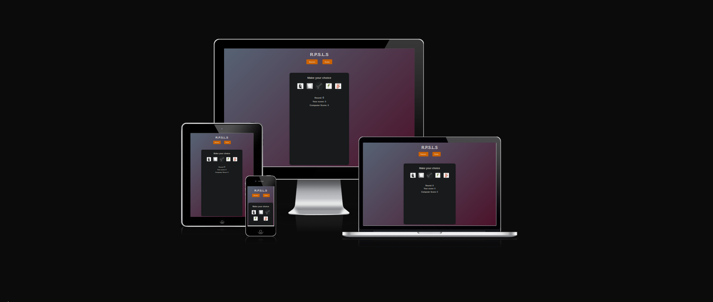

# Rock-paper-scissors-lizard-spock

For the second project with **Code Institute** I created a Rock Paper Scissors Lizzard Spock game.

[View the live project and play the game here](https://namlex.github.io/Rock-paper-scissors-lizard-spock/)

[The repository is here](https://github.com/NaMlex/Rock-paper-scissors-lizard-spock)

## Description

Rock, Paper, Scissors, Lizard, Spock is an improved version of the standard game of chance "Rock Paper Scissors". It got popular when it was mentioned in the comedy 'The Big Bang Theory', but initially it was created by Sam Kass and Karen Bryla.

### How to play?

This game has 5 options

**Rules of the game:**

**And with three possible results:**

- Win
- Lose
- Draw

## Ux Design

- ### User Stories

**Reasons a users to visit the website:**

- Trying an advanced level of the classic 'Rock Paper Scissors' game.

- Playing an online game of chance against the computer.

**Reasons for the website:**

- Give the user the opportunity to play a few rounds against a machine.

- Give the user a mentally challenging game with more options to remember.

- ## Scope

**What a user may expect:**

- A simple way for choosing an option and facing his opponent.

- Score and round counters.

- See the computer's choice.

**What a user may want:**

- A help button for checking the rules of the game.

- A restart button for starting a new game at any moment without waiting until the last round.

## Technologies Used

### - Languages used

- HTML5

- CSS3

- JavaScript

- [Am I Responsive:](http://ami.responsivedesign.is) Checking the responsive.

- [GitHub:](https://github.com/) GitHub is used to store the projects code after being pushed from Git.

### - Tools

- [Am I responsive](http://ami.responsivedesign.is/#): Was used to simulate how the game looks at different screen sizes.

- [GitHub](https://github.com/) : Was used as the repository for the project's code.

- [Jigsaw validator](https://jigsaw.w3.org/css-validator/) : Was used to validate the CSS file.

- [W3C validator](https://validator.w3.org/): Was used to validate that the HTML file.

- [Lighthouse](https://developer.chrome.com/docs/lighthouse/overview/) : Was used for performance tetsing.

## Testing

### Browser testing
- I have tested that this page works using Linux(Manjaro)

- I have tested that this page works in the 
following browsers using Linux: Chromium and Firefox.

- I have tested this page works on android devices using DuckduckGo browser (Pixel 3a).

### Responsivness
- Chromium developer tool have been used to check the responsivness.

- I have tested that this page works on different screen sizes 

### Validator Testing

- W3C HTML

- W3C CSS

- Chromium Lighthouse

## Deployment

### HOW THIS SITE WAS DEPLOYED

- In the GitHub repository, navigate to the "Settings" tab.

- In Settings, choose "Pages" from the left hand menu.

- Under "Source", select branch "Main" and select folder "(Root)".

- Click Save and the page will be automatically refreshed with a detailed ribbon display to indicate the successful deployment.

## Credits

- Mentor support, guidance, and tips to improve my coding skills throughout the project:
  - **Brian Macharia**

- Creators of the game:
  - **Sam Kass and Karen Bryla**

- The Big Bang Theory TV show for the visual explanation:

  - <https://www.youtube.com/watch?v=x5Q6-wMx-K8>

